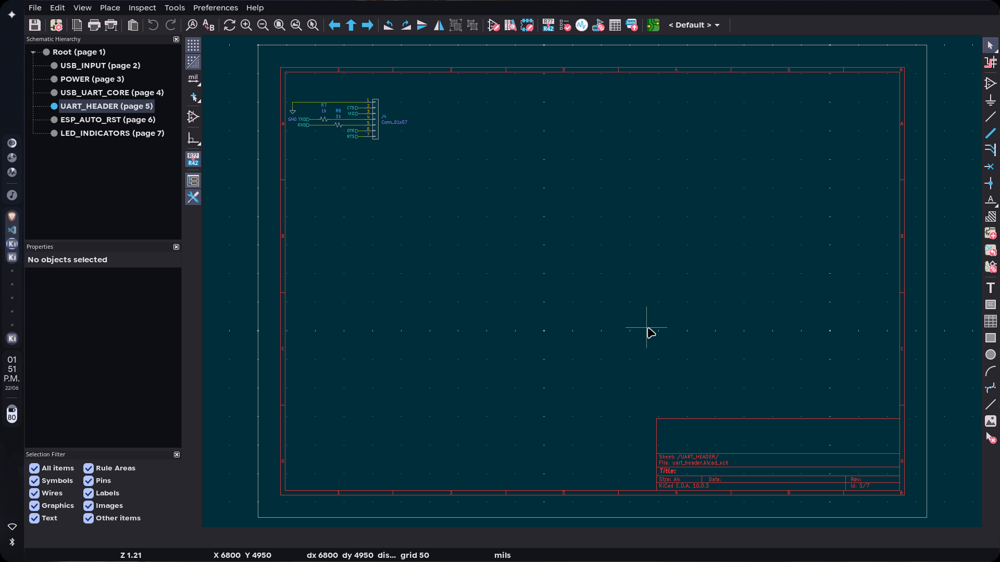
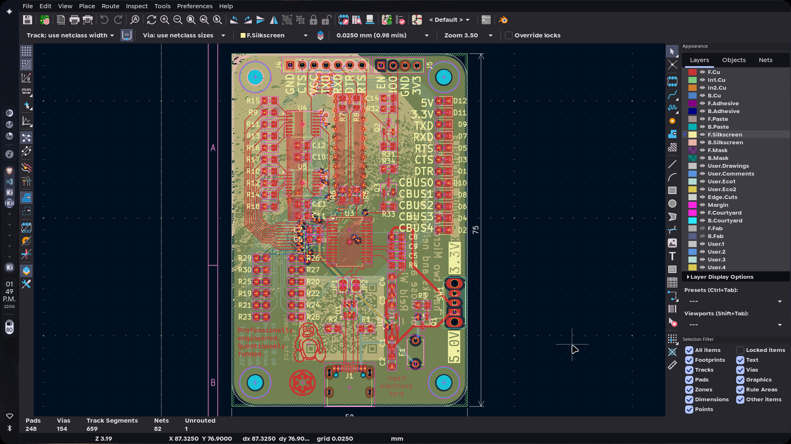

# June 10: project start and component selection

started the project. needed a usb-to-uart board for flashing esp32 and other mcus.
chose the ft232rl as the main ic since it's well supported and cheap.
added usbLC6 for esd protection on the usb lines.
picked the tlv75733 for 3.3v regulation with a switchable 5v option.
going with usb-c for the connector since it's 2026.

**Total time spent: 2 hours**

# June 11: schematic - power section

drew out the power section of the schematic.
usb-c connector with cc resistors (5.1k pulldowns for ufp).
esd protection on d+/d-.
pptc fuse for overcurrent protection.
3.3v ldo with input/output caps.
added the voltage selection switch between 3.3v and 5v.

**Total time spent: 3 hours**

# June 13: schematic - ft232rl core

added the ft232rl and surrounding circuitry.
crystal-less design since ft232rl has internal clock.
decoupling caps on all power pins.
connected the status pins (tx, rx, rts, cts, dtr, dsr, dcd, ri) to led indicators.
added the auto-reset circuit for esp-style programming with npn transistors on dtr and rts.

**Total time spent: 4 hours**

# June 14: schematic - leds and connectors

finished the led indicator section. 12 leds total for all the status signals.
added the 2x pin headers - 1x7 for main uart signals and 1x4 for extra gpio/cbus.
all 0805 package for easy hand soldering.
did a final review of the full schematic, caught a few net naming issues.

**Total time spent: 3 hours**

# June 16: initial pcb layout

imported the netlist and placed all components.
kept the usb connector on one edge and headers on the opposite.
grouped bypass caps near the ft232rl.
board is 75x50mm with m3 mounting holes in the corners.
started with a 4-layer stackup - signal/gnd/power/signal.

**Total time spent: 4 hours**

# June 17: pcb routing

started routing. power traces are 0.5mm, signal traces 0.2mm.
used inner layers for ground and 3.3v planes to keep routing clean.
routed the usb differential pair with matched lengths.
added copper pours for ground on both outer layers.

**Total time spent: 5 hours**

# June 18: pcb routing continued

finished routing all the signal traces.
connected all the led indicators through current limiting resistors.
added thermal relief pads to the power plane connections.
ran drc and fixed a few clearance violations near the usb connector.

**Total time spent: 4 hours**

# June 19: final pcb touches

added silkscreen labels for all connectors and key components.
put the project name and version on the board.
added a moon graphic on the silkscreen as a little easter egg.
did final drc check - all passed.

**Total time spent: 3 hours**

# June 20: finished board

finished the board.
added moon silkscreen and some more easter eggs, even though it will probably be only me that uses it

**Total time spent: 6 hours**

# June 21: polishing repo
adding images from kicad and will start blendering soon for some cool renders
i need to learn how to make the renders faster.

**Total time spent: 2 hours**

# June 23: Blender
started blender model for pcb
red solder mask, white silkscreen, enig finish

**Total time spent: 3 hours**

# June 24: polish readme
adding images to readme and make bom.csv draft for parts and whatnot
will make more blender renders soon with animations and effects

**Total time spent: 3 hours**

# June 25: BOM
looked for parts and made a bom
parts are from lcsc
added pcbs from jlcpcb and pcbway just in case
the more the merrier they say

**Total time spent: 4 hours**