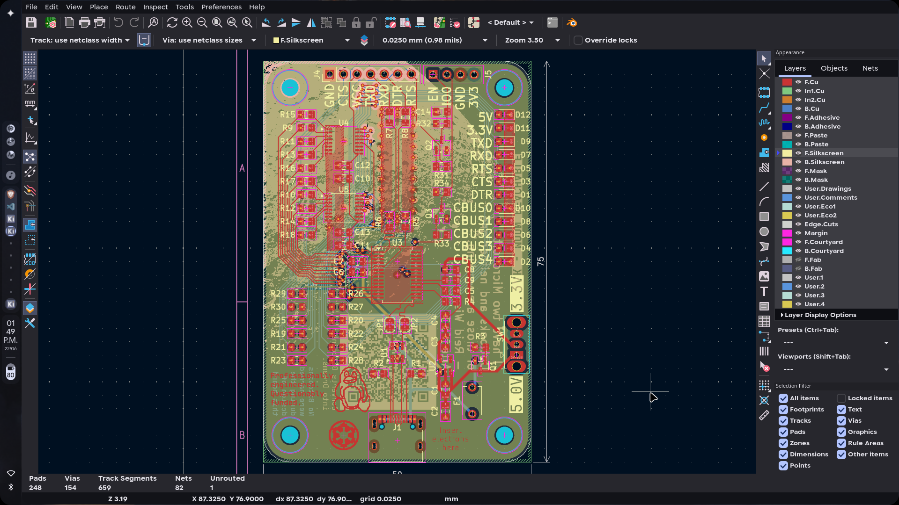
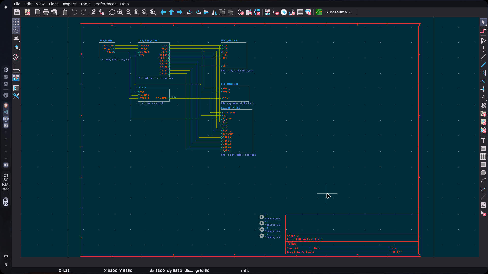
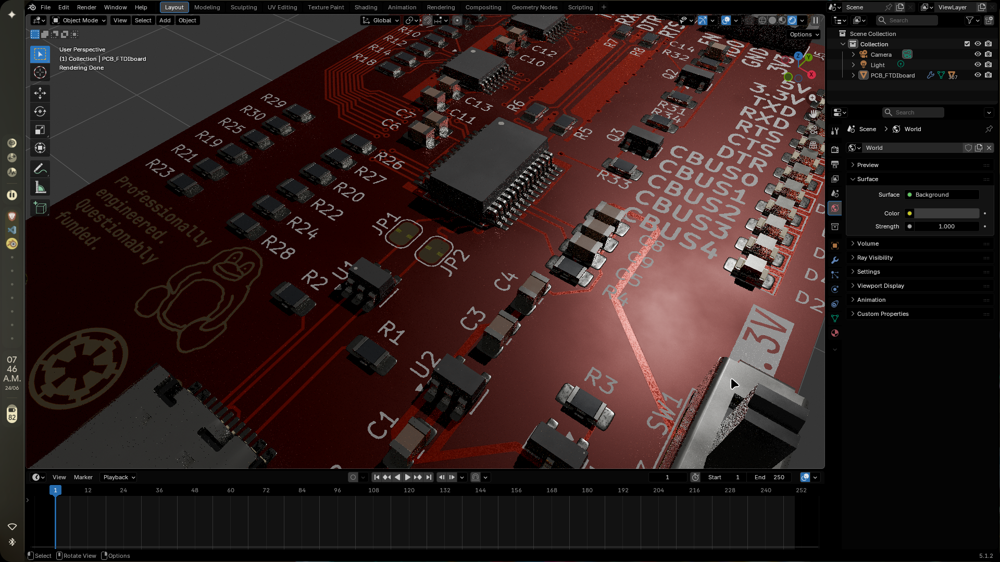
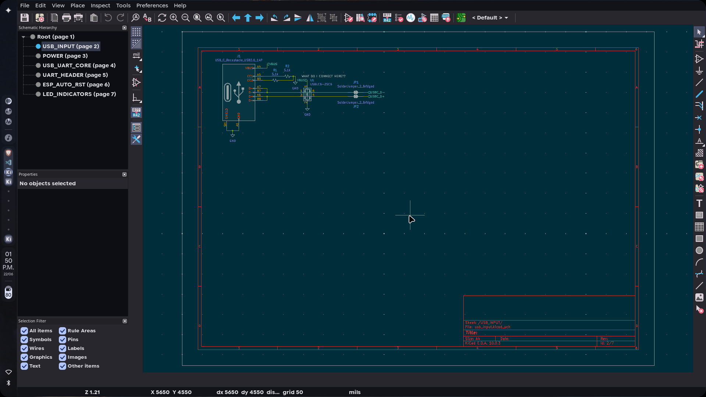
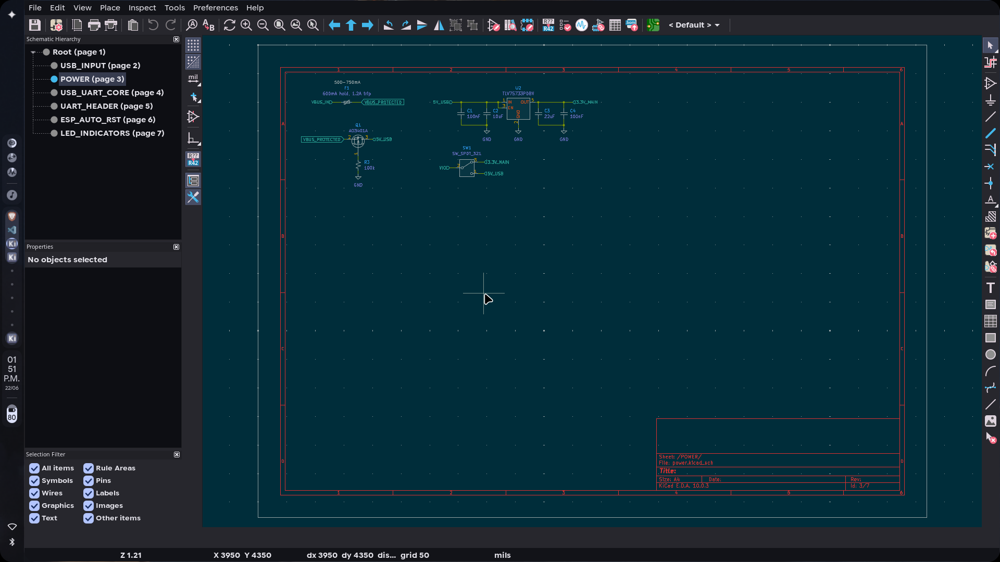

# June 20: finished board

finished the board.
added moon silkscreen and some more easter eggs, even though it will probably be only me that uses it

**Total time spent: 6 hours**

# June 21: polishing repo
adding images from kicad and will start blendering soon for some cool renders
i need to learn how to make the renders faster.

**Total time spent: 2 hours**

# June 23: Blender
started blender model for pcb
red solder mask, white silkscreen, enig finish

**Total time spent: 3 hours**

# June 24: polish readme
adding images to readme and make bom.csv draft for parts and whatnot
will make more blender renders soon with animations and effects

**Total time spent: 3 hours**

# June 25: BOM
looked for parts and made a bom
parts are from lcsc
added pcbs from jlcpcb and pcbway just in case
the more the merrier they say

**Total time spent: 4 hours**