# June 10: project start and component selection

started the project. wanted to build a usb-to-uart board for flashing esp32 and other mcus, got tired of using ones where i cant see the insides. the lab ones are always either broken or being used by someone else anyway.

spent a while on the ic. ft232rl is old but its cheap and everyone has docs on it. looked at cp2102 too but the ft232rl has more cbus pins and full flow control so it wins for debugging. probably should have checked if its end of life yet but whatever, its everywhere so itll be fine.

picked tlv75733 for 3.3v because i have lots lying around, switchable to 5v for the output. usblc6 for esd on the data lines. pptc fuse on the input because im clumsy and i dont want to fry a laptop usb port. usb-c because its 2026, but i had a lot of those lying around too.

wrote out the whole passive list too - 25x 10k, 4x 1k, a 100k, 2x 5.1k, 2x 33r, and the caps. all 0805 because i dont hate myself. made the kicad project skeleton.

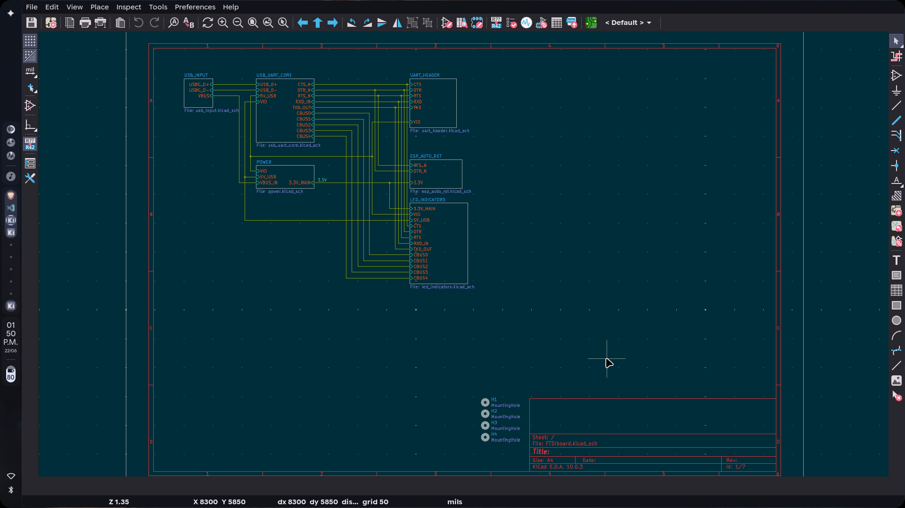

**Total time spent: 2 hours**

# June 11: schematic - power section

did the power section first.

usb-c with two 5.1k cc pulldowns so it acts as a device. took forever to get the orientation and cc1/cc2 wiring right, and figuring out which pins to tie for usb2.0. kept second guessing whether i needed the shield connected to gnd or through a resistor.

esd protection with usblc6 between d+/d- and gnd. 33r series on each data line, sized the caps so the impedance stays in usb2.0 range. the differential impedance math took me a few tries but i think ive got it close enough, usb2.0 is forgiving. if it doesnt work i can use different parts

pptc on vbus with a 100nf right at the connector. ldo with 10uf in and out, plus a 4.7uf further down the rail. the slide switch picks between 3.3v and 5v.

tricky bit was making sure the switch cant back-feed the regulator and short vbus to gnd. ended up putting the mosfet in the load path to stop that. not sure if its overkill but its cheap and it works.

**Total time spent: 3 hours**

# June 13: schematic - ft232rl core

added the ft232rl.

crystal-less, it has an internal clock, saved a bunch of space and a couple of parts. checked the osc settings work at both 3.3v and 5v. honestly glad i dont have to mess with crystal load caps, those always trip me up.

decoupling caps on every power pin, right values on the internal reg output. went through the datasheet pin by pin so nothing floats - pulled the unused ones to a known state. the datasheet pdf is ancient but at least its thorough.

hooked the status pins (txd rxd rts cts dtr dsr dcd ri) to the led network.

then the esp auto-reset circuit with the two bc817s on dtr/rts. this was the worst part. the ide toggles dtr/rts to enter bootloader and the transistors have to pull esp enable and gpio0 at the right times. spent ages getting the polarity right so the reset sequence matches what esptool wants, 100k pullup on reset so it sits high by default. i read like three different forum posts about this before it clicked (wonderous foreshadowing here).

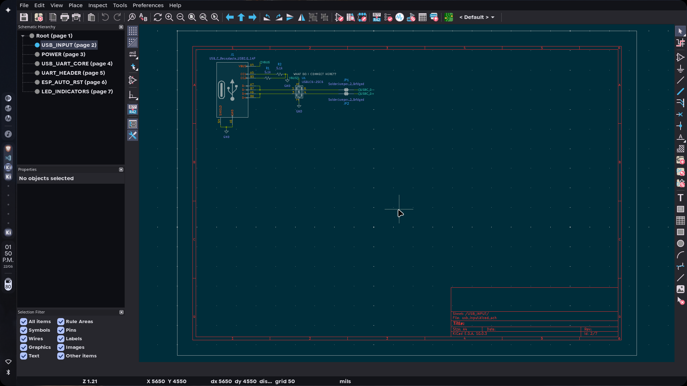

**Total time spent: 4 hours**

# June 14: schematic - leds and connectors

finished the leds. 12 of them. 2 green for power, yellow for tx, blue for rx, 2 orange for flow control, red for dtr, 5 white for cbus. probably way more than i need but i like seeing what the chip is doing at a glance, plus leds=fun.

each one gets a 1k series resistor so they run at like 2-3ma. had to redo the values per color since red/blue/green/yellow/white all have different forward voltages. the blues and whites are annoyingly bright even at low current so i might dial those back later.

added the headers - 1x7 for uart, 1x4 for extra cbus/gpio. everything 0805 so i can hand solder it. i hate soldering anything smaller than 0805, did enough of that in the lab already.

also put in two uln2003s to buffer the cbus outputs, open-collector so i can switch bigger stuff than leds later. honestly not sure i need them but theyre cheap insurance.

did the full review at the end, ran erc. caught two nets that were the same signal with different names and a polarity error on a transistor. fixed em, erc is clean now. saved a real headache down the line with those net names, board house would have probably rejected it.

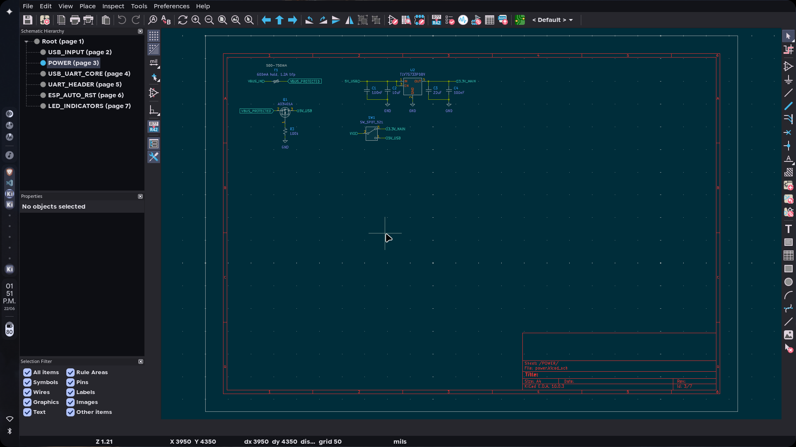

**Total time spent: 3 hours**

# June 16: initial pcb layout

imported the netlist and started placing.

usb connector on one edge, headers on the opposite so it sits nice on a breadboard. ft232rl in the middle with bypass caps shoved right against its power pins. i kept the caps within a couple mm of the pins, that whole "0.1uf as close as possible" thing is real.

led resistors next to their leds to keep the fan-out clean. power stuff (ldo switch mosfet) in a corner so the switching noise stays away from usb. also rotated the silkscreens around so the labels wouldnt be upside down, small thing but it bugs me.

75x50mm with m3 holes in the corners, fits a case. went 4-layer - signal/gnd/power/signal - makes routing way easier. costs a bit more per board but whatever, this is a one off.

moved components around a lot until the ratsnest crossings were low and the usb path to the ft232rl was short. placement is everything, bad placement ruins the routing later.

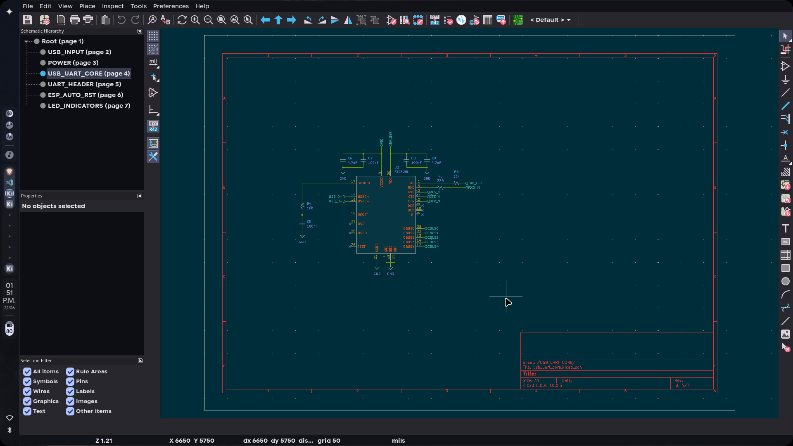

**Total time spent: 4 hours**

# June 17: pcb routing

started routing. 0.5mm power traces, 0.2mm signals, 0.2mm clearance. probably fine for the currents here, the leds barely draw anything.

inner layers are the gnd and 3.3v planes so the outer layers stay free for signals. this is why 4-layer is nice, i barely had to think about return paths, there's a plane under everything. no ground loops to worry about on a board this small anyway.

did the usb differential pair first since its the critical one. kept d+/d- together and length matched, series resistors inline, no vias in the pair. matched them to within like a mm which is way better than usb2.0 needs.

set up the planes with thermal reliefs so soldering isnt a nightmare of heat sinking. first board i forgot those and the whole plane was a heatsink, never again.

then fanned the ft232rl out - status pins to their leds and resistors, power rails to the planes.

**Total time spent: 5 hours**

# June 18: pcb routing continued

finished the rest - auto-reset circuit, cbus buffering, header connections. the auto-reset transistors got shoved in a corner with their resistors which is a bit cramped but it fits.

got all the leds routed through their resistors as a clean fan-out from the status pins. tried to keep the led traces grouped by color so the board looks organized.

thermal reliefs on the plane connections, 33r usb resistors as close to the connector as i could get them.

drc flagged a few clearance violations near the usb connector where the cc resistors and esd were fighting for space. fixed those, and some ugly via fanout angles. widened a couple power traces after adding up the led current, 0.5mm was honestly fine but 0.7mm feels safer.

cleaned up the rest - killed unnecessary vias, straightened traces so it doesnt look like spaghetti. this always takes longer than i expect, its the fiddly part of routing.

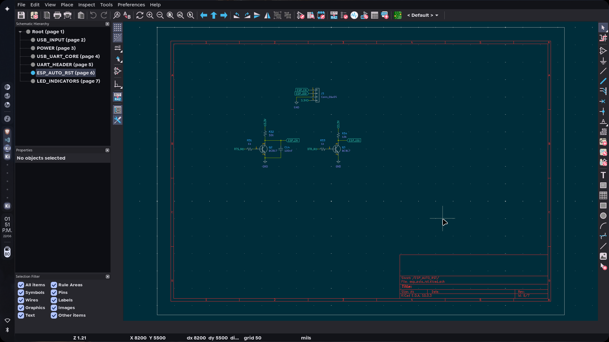

**Total time spent: 4 hours**

# June 19: final pcb touches

silkscreen labels on everything. connectors, switch positions (3.3v/5v), led polarity, reference designators where you can actually read them. left enough space around the labels so they dont get wiped out by the mask.

project name and version on the board, small maker mark.

added a moon on the silkscreen as an easter egg. took a while to get the graphic converted so it wouldnt overlap pads or courtyards. traced it in inkscape first because i couldnt find a good image to import.

final drc across everything - clearance, silkscreen to pad, courtyard overlaps, unconnected nets. all passed. honestly thought thered be something but it was clean first try.

exported gerbers and checked em in the previewer so nothing was flipped or missing. drill file looks right too.

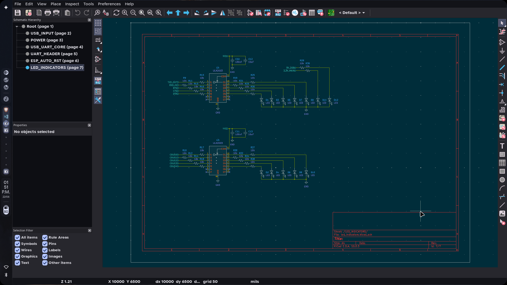

**Total time spent: 3 hours**

# June 20: finished board

finished the board.

added more easter eggs - a tiny rocket next to the moon, and a smiley on the back. probably only me that ever uses this but the details make it fun. noticed the smiley and the rocket kind of tell a story which is neat.

checked the ft232rl footprint against the datasheet pin spacing again, usb connector pins line up, mounting holes clear everything. printed it out at 1:1 on paper just to eyeball the component sizes and make sure nothing felt impossibly small.

exported the final fab files - gerbers, drills, pick and place. last look in the 3d viewer. went back and forth on the solder mask color for like an hour before ordering, ended up purple.

**Total time spent: 6 hours**

# June 21: polishing repo
adding images from kicad and will start blendering soon for some cool renders
i need to learn how to make the renders faster.
spent a bunch of the time just exporting screenshots from kicad and cropping them so they dont look terrible in the readme.

**Total time spent: 2 hours**

# June 23: Blender
started blender model for pcb
red solder mask, white silkscreen, enig finish
set up a few test renders to get the lighting right, the board keeps coming out too dark or too shiny, still fiddling with it
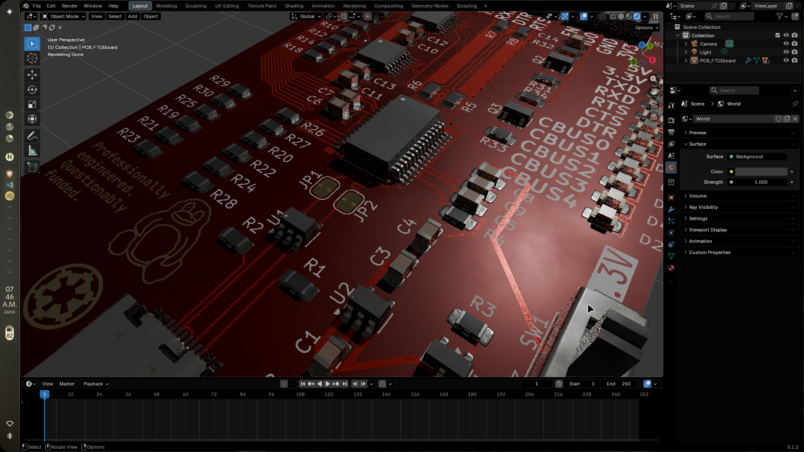

**Total time spent: 3 hours**

# June 24: polish readme
adding images to readme and make bom.csv draft for parts and whatnot
will make more blender renders soon with animations and effects
also played around with a turntable animation idea for the board, not sure if i'll commit to it yet

**Total time spent: 3 hours**

# June 25: BOM
looked for parts and made a bom
parts are from lcsc
added pcbs from jlcpcb and pcbway just in case
the more the merrier they say
took a while going through every single resistor and cap to find the right lcsc part number, stock kept running out on the cheap ones

**Total time spent: 4 hours**

# August 22: boards arrived, soldering

pcbs finally showed up. purple mask looks even better in person than the renders.
decided to try paste this time instead of soldering every pad by hand. spread it on with a stencil-ish approach, took a bunch of progress shots because it was weirdly satisfying.

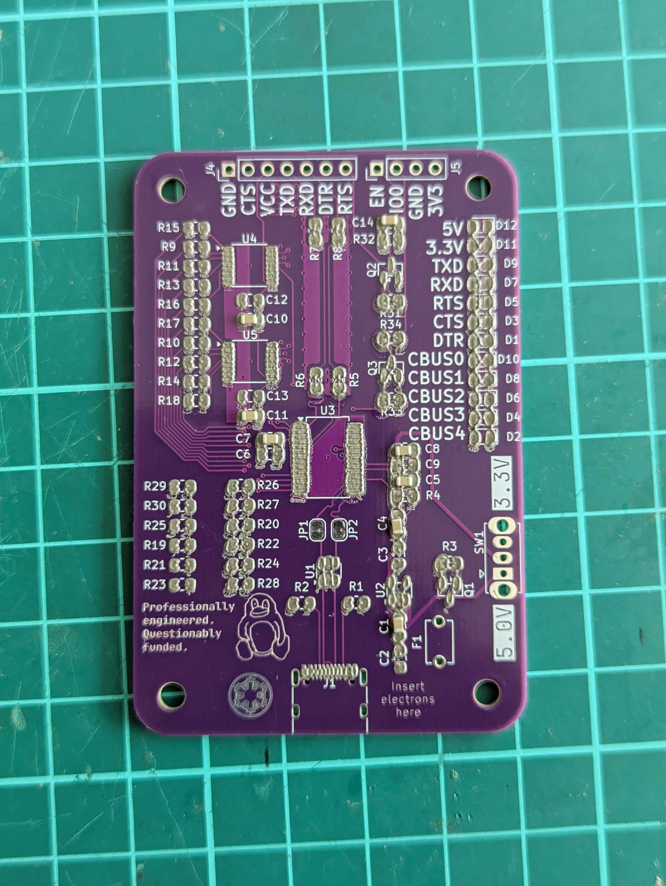
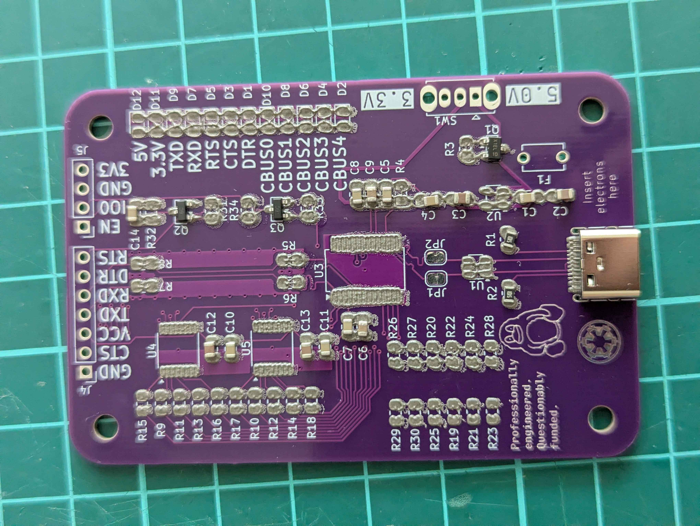
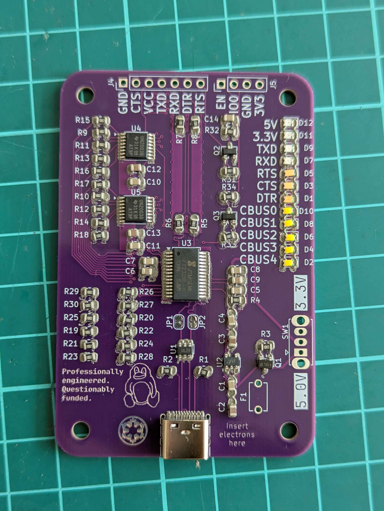

placed everything while the paste was tacky. got a bridge between two pins on the ssop-28 ft232rl and one on a uln2003 (tssop-16), dragged those out with flux and wick. checked every pin under the magnifying glass after that.

skipped the fuse for now, figured id deal with it later.
powered it up for the first time... nothing caught fire or released magic smoke, so thats a win.

**Total time spent: 4 hours**

# August 22: bring up and testing

first proper test. checked the rails with the multimeter before plugging anything important in - 5v on vbus after where the fuse should be, and 3.3v coming off the ldo nice and stable. both within spec.

did have to do some surgery: never bothered fitting the pptc, just blobbed solder across its pads instead. also cut a trace and jumpered it. not gonna pretend either of those were in the plan.

after all that, plugged into the laptop and it enumerated straight away - lsusb picked it up, no driver drama.

didnt get around to testing the esp auto-reset flashing yet, will do that next session. but the core of the board works which means the schematic wasnt garbage after all.

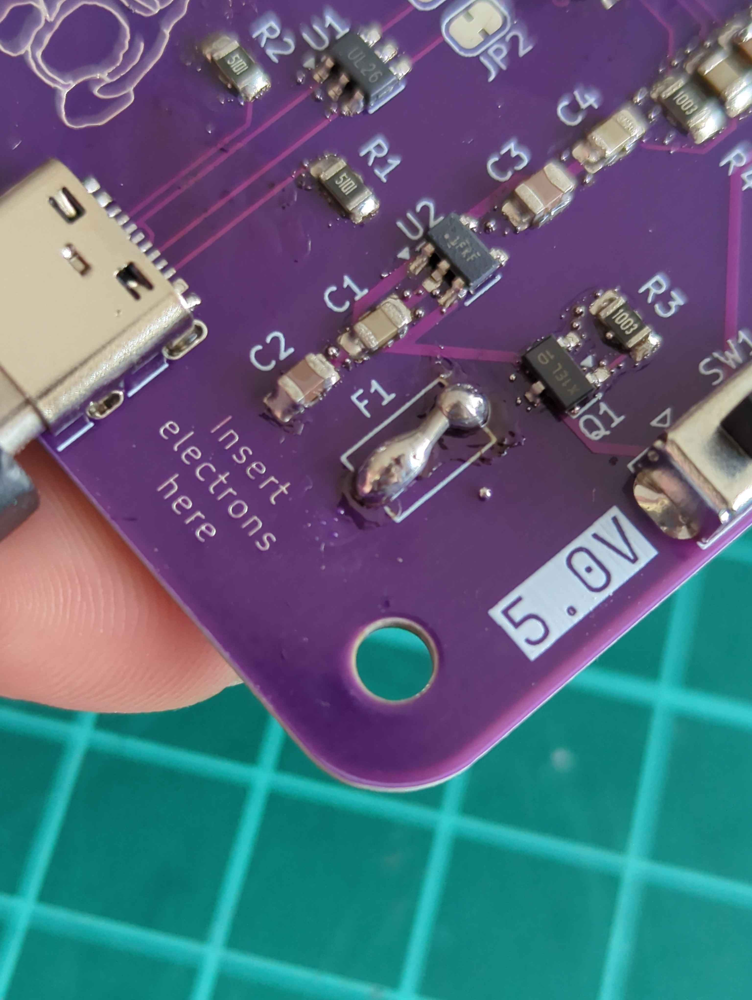
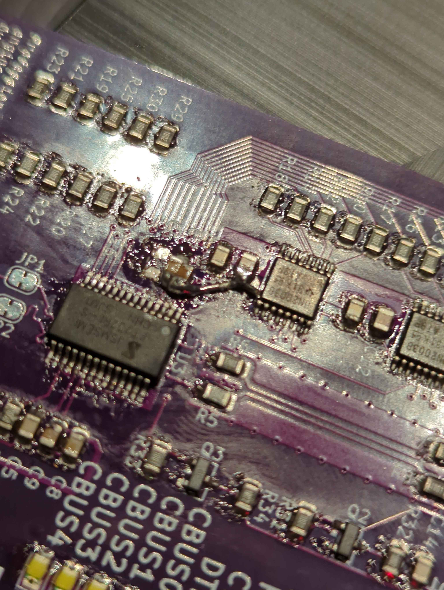
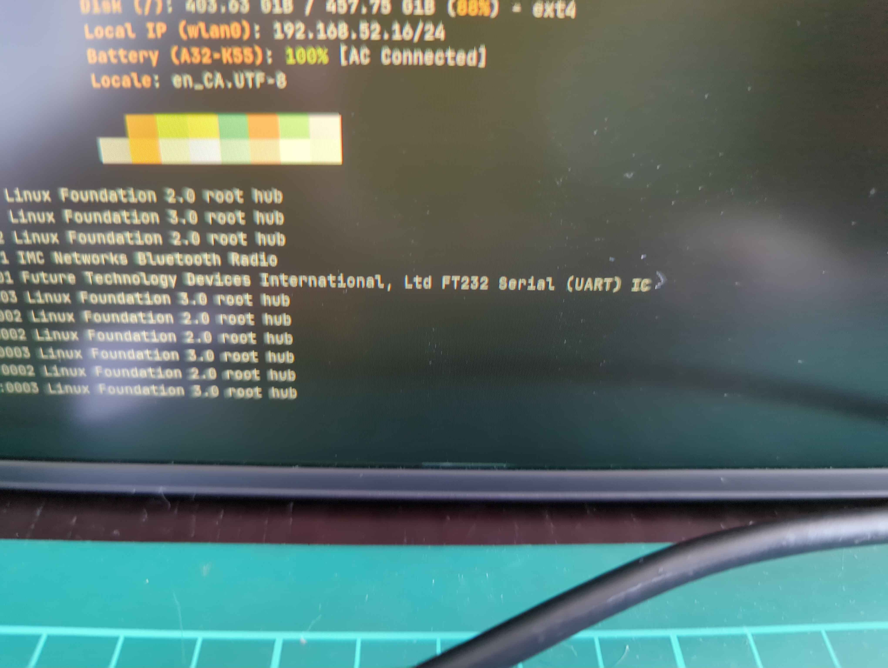

video of the fuse bridge:
[bridging the fuse](images/V1/bridge_fuse_with_tweezers.mp4)

**Total time spent: 4 hours**

# August 23: proving the board actually works

before trusting the board in a real flash attempt i wanted hard evidence it wasnt garbage.

lsusb picked up the ft232rl straight away - 0403:6001, ftdi_sio bound clean, factory eeprom strings since i never programmed any. loopback test through the header pins passed. then passed AGAIN later mid-session just to be sure. board exonerated twice, feels good.

while poking around i confirmed the vccio bug id suspected - io pins stay at 3.3v even with the switch flipped to 5v, worked fine until you actually use the switch. bodged a wire so vccio follows the switched rail. also caught the auto-reset stage latching: after the first trigger it held enable down until you pulled power. added a bodge resistor so it releases properly.

characterized the power budget while i was in there (idle / leds all lit / data blasting) and dumped todays findings into the grant narrative. honestly the war stories section writes itself.

**Total time spent: 3 hours**

# August 23: the esp32 flashing saga

this ate my whole evening. tried flashing an esp32 devkit through the board and got absolutely nothing on rx.

the confusion spiral was real. passive listen at 115200: silent. baud scan across every rate i know, both dtr/rts polarities: silent. the multimeter showed weak 1-3v swings which turned out to be the dmm averaging square waves. spent ages doubting my wiring labels until a grounding exercise pin by pin proved they were right all along.

built some c probes against libftdi1 to get at the raw pins - pin level sampling, a slow toggle to verify with the meter, live edge monitoring, and async bitbang waveform captures. learned the hard way that every raw libftdi run detaches the kernel driver and never gives it back, so /dev/ttyUSB0 kept vanishing and masquerading as hardware faults. manual sysfs rebinding after every probe. only one genuine bus disconnect the entire night.

then the side quest: the uno i grabbed to test the cable half-enumerated with error -71, zero interfaces. same cable on a different port: clean enum plus a 45 second stress test, 85kb written, zero errors. verdict - the pc usb port is faulty. not the cable, not the board. moved everything to the good port and switched to the sparkfun cable for the rest of the night, it just works.

breakthrough: after swapping wires at the devkit end, the waveform capture showed six dense uart bursts, and a live listen during reset caught the full boot rom text at 115200 - rst:0x1 (POWERON_RESET), boot:0x13 (SPI_FAST_FLASH_BOOT), the whole banner. turns out its an adafruit huzzah32 breakout, no onboard usb-serial and no auto-reset circuit.

endgame: esptool still refuses to connect even with the download-mode banner showing seconds before each try. byte level trace shows valid sync frames going out, 100ms waits, zero response, thirty times over. grounds verified at ~0 ohm, levels safe at 3.3v logic, both jumper wires individually proven conductive, adapter loopback re-passed mid session. even applied the adafruit erratum - pre aug 2020 boards ship missing the 1k rx pull up - added one externally, verified electrically. still nothing. twenty rounds of raw sync patterns later the only catch was another stray boot banner from an accidental reset press.

final verdict: my board fully functional, cable good, port replaced, wiring correct. the esp32 boots and runs fine but uart0-rx seems deaf - can boot existing flash, cant take new flashes over serial. gonna cross check with a borrowed adapter before condemning the chip.

oh and the host logs were spamming pcie correctable errors from the gpu slot all night. platform level electrical noise, worth watching.

**Total time spent: 5 hours**

# September 1: v1.1 redesign

went back to the schematic and cut a bunch of stuff out. the build worked but there was obvious fat to trim.

the uln2003s are gone. i added em back in june as "cheap insurance" for buffering cbus outputs but honestly i never used them for anything and they were just dead weight eating board space and adding eight resistors plus four caps to the bom. open collector drivers sounded cool on paper but the leds and headers work straight off the ft232rl pins fine. deleted u4 and u5 and everything hanging off them.

added a second fuse. f1 on vbus stays as the main overcurrent protection but i put a fine 2.5a 0603 polyfuse downstream of it. idea is one fuse catches gross shorts at the connector and the smaller one protects the actual rails a bit tighter. probably overkill but im clumsy and cheap insurance turned out to not be that cheap last time.

also dropped in a 13th led, one more cbus indicator so every cbus pin is visible now.

renamed the headers j4/j5 to j2/j3 while i was in there, the old numbering was just leftover nonsense from the original layout.

then the killer part - rerouted the whole pcb. placement got a full shuffle which meant redoing most of the traces anyway, and i tidied up the ones that were ugly the first time. kept the 4-layer stackup because the planes make everything simpler. gerbers regenerated and the board file is way cleaner than v1.0.

bonus: the whole netlist got revisited and the board was laid out fresh instead of bolting onto the old routing, so all the weird quirks i found while testing the v1.0 proto got a chance to be done right this time around.

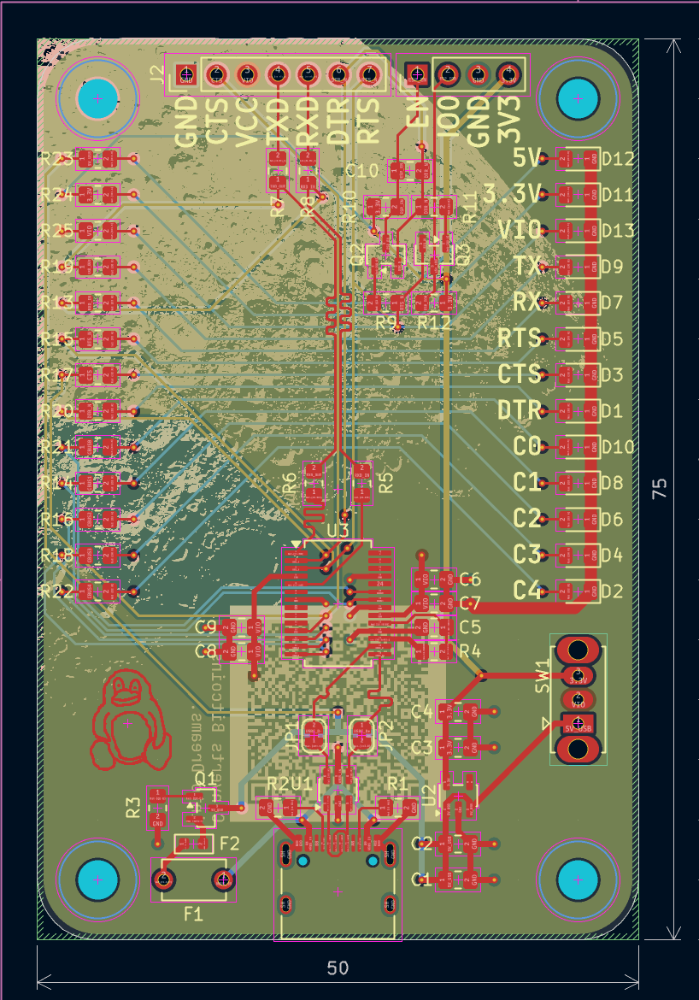

**Total time spent: 4 hours**

# September 2: proving the board actually works

finally did the real tests. not "lsusb says hello" tests, actual bit-level stress proving the board is electrically sound.

started with self-loopback, jumpered tx to rx, 500 blocks of 512 bytes at 115200 baud back to back. 500 out of 500 passed, zero bad bytes! 8.7 kB/s. that was the test. 512 bytes was chosen on purpose because thats exactly the block size that triggers bit flips through the esp32, if the board alone can push 512 bytes clean 500 times in a row, the tx/rx driver is fine. (in theorey)

then did a direct pc loopback (board tx/rx jumpered, driven by the host) - 100x32 byte chunks, 100/100 clean. board + cable + pc port all proven in one shot.

reconnected the esp32 for integration testing. light traffic (16 byte frames with 50ms gaps) passed 20/20. short frames under 64 bytes with even 100us gaps: 100% clean. single bytes: 300/300. the board talks to the esp32 just fine for normal paced uart traffic.

Issues:
- esp auto reset circuit wired incorrectlly
- vio trace too thin for esp32

wrote all the findings into the grant narrative too. real engineering war stories beat smooth sailing every time.

**Total time spent: 4 hours**
