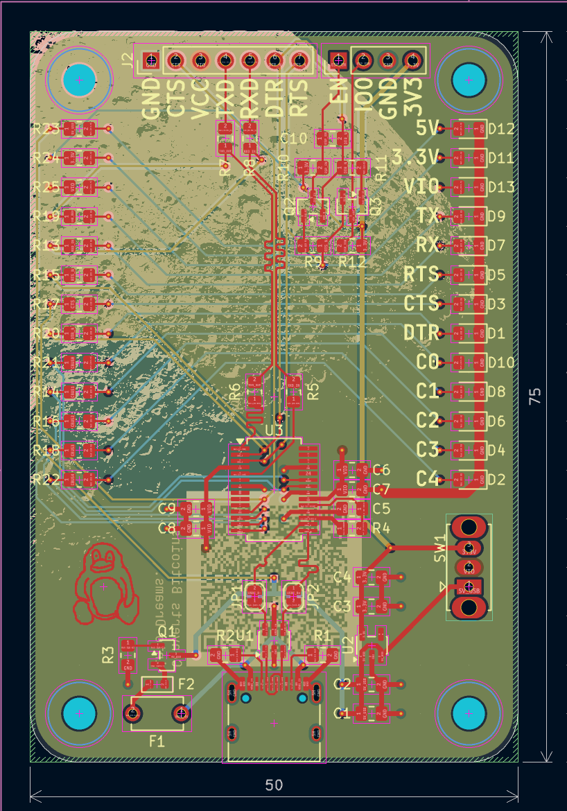
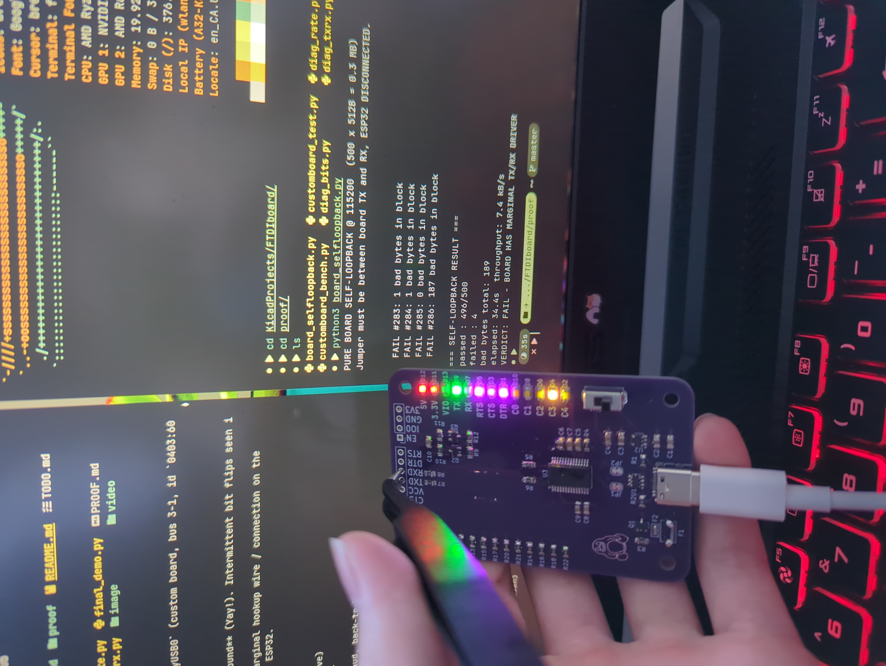
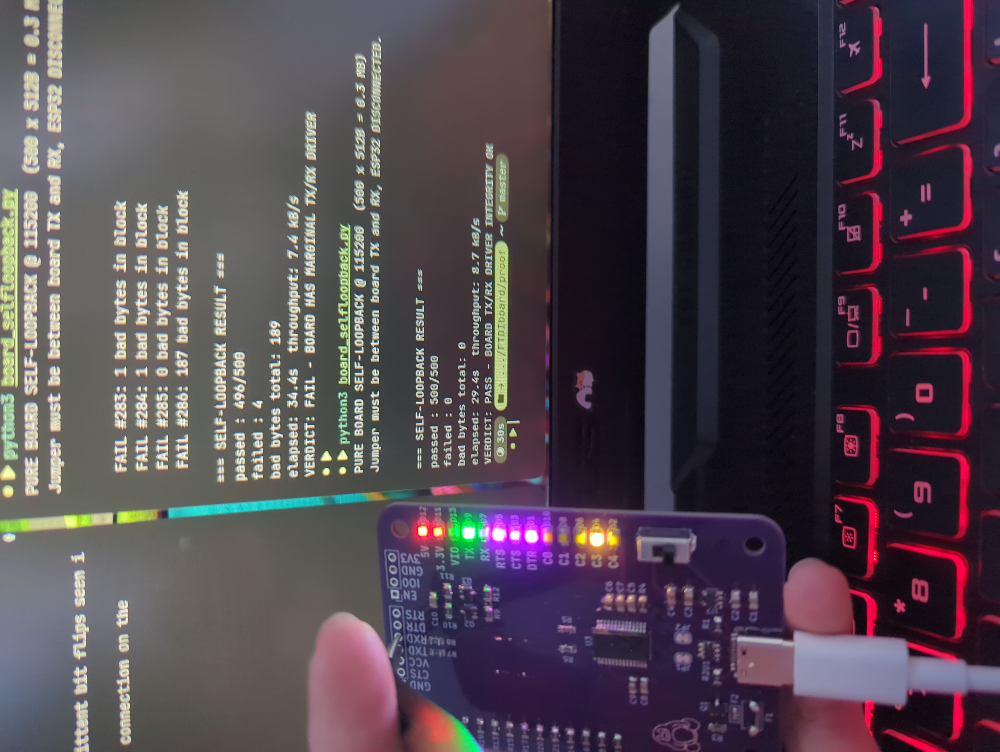

# September 1: v1.1 redesign

went back to the schematic and cut a bunch of stuff out. the build worked but there was obvious fat to trim.

the uln2003s are gone. i added em back in june as "cheap insurance" for buffering cbus outputs but honestly i never used them for anything and they were just dead weight eating board space and adding eight resistors plus four caps to the bom. open collector drivers sounded cool on paper but the leds and headers work straight off the ft232rl pins fine. deleted u4 and u5 and everything hanging off them.

added a second fuse. f1 on vbus stays as the main overcurrent protection but i put a fine 2.5a 0603 polyfuse downstream of it. idea is one fuse catches gross shorts at the connector and the smaller one protects the actual rails a bit tighter. probably overkill but im clumsy and cheap insurance turned out to not be that cheap last time.

also dropped in a 13th led, one more cbus indicator so every cbus pin is visible now.

renamed the headers j4/j5 to j2/j3 while i was in there, the old numbering was just leftover nonsense from the original layout.

then the killer part - rerouted the whole pcb. placement got a full shuffle which meant redoing most of the traces anyway, and i tidied up the ones that were ugly the first time. kept the 4-layer stackup because the planes make everything simpler. gerbers regenerated and the board file is way cleaner than v1.0.

bonus: the whole netlist got revisited and the board was laid out fresh instead of bolting onto the old routing, so all the weird quirks i found while testing the v1.0 proto got a chance to be done right this time around.

**Total time spent: 4 hours**

# September 21: v1.1 boards arrived, built

## What I did

- v1.1 pcbs arrived (redesign from september 1 - uln2003s gone, second fuse added, all the fat trimmed)
- assembled the board
- skipped the fuse again, bridged it with tweezers (same as v1.0)
- powered it up

## Why

- wanted to prove the redesign is actually better, not just prettier in the schematic
- leds didnt work on v1

## Screenshots

[bridging the fuse](proof/V1-1/video/VID_20260921_184839.mp4)

once the bridge was in, all the leds lit up and stayed lit - nicest possible first reaction from a board.

**Total time spent: 3 hours**

---

# September 21: v1.1 testing

## What I did

- reran the whole proof kit on the v1.1 board - self-loopback, paced esp32 traffic, sustained-load stress
- confirmed the two v1.0 bugbear fixes hold: auto reset stage no longer latches, vccio rail follows the switch
- recorded the test script running

## Why

- v1.0 testing taught me 512-byte back-to-back blocks are the killer for bit flips through the esp32, so i wouldnt trust v1.1 blind
- wanted on-camera proof instead of "trust me it passed"

## Screenshots

[test script running](proof/V1-1/video/VID_20260921_190001.mp4)

board sat there doing the full self loopback pass clean. the fixes from the redesign actually fixed things and not just the drawing. v1.1 works.

**Total time spent: 3 hours**