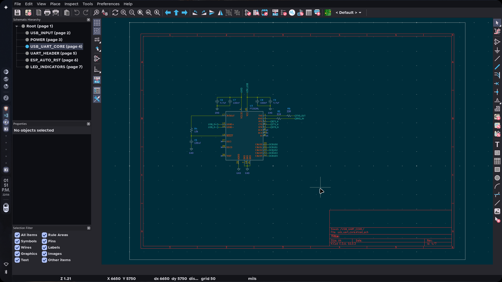
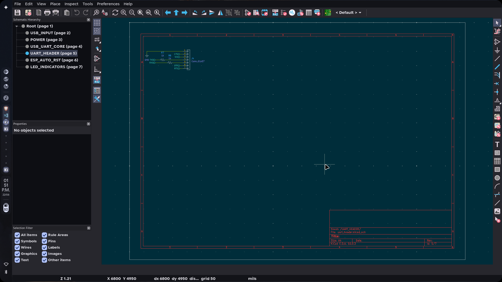
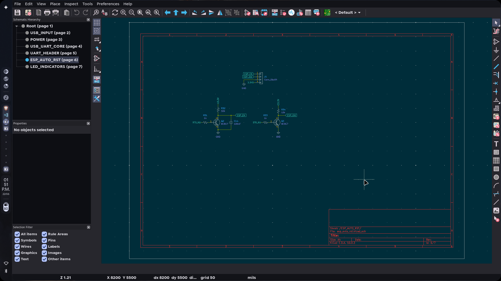
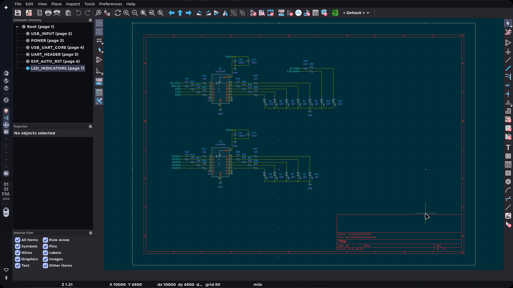
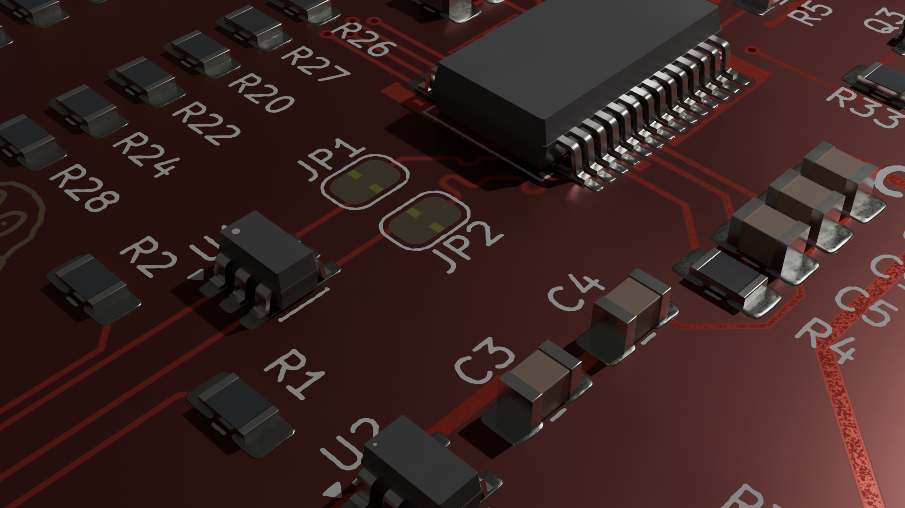

# FTDIboard

FTDIboard is a compact USB-to-UART development interface with FT232RL, switchable 3.3V/5V logic, ESP-style auto-reset, ESD protection, and status LEDs.

---

## Key Features

- FT232RL USB-to-UART bridge
- Switchable 3.3V / 5V logic levels  
- ESP-style auto-reset (DTR-based)
- USB ESD protection (USBLC6)
- Resettable fuse (PPTC)
- Multiple status LEDs
- Compact 75×50mm, 4-layer PCB
- M3 mounting holes
- 2.54mm standard headers

---

## Bill of Materials

| References | Qty | Value | Footprint |
|------------|-----|-------|-----------|
| U4 U5 | 2 | ULN2003 | TSSOP-16 |
| U3 | 1 | FT232RL | SSOP-28 |
| U2 | 1 | TLV75733PDBV | SOT-23-5 |
| U1 | 1 | USBLC6-2SC6 | SOT-23-6 |
| C1 C4 C5 C7 C8 C10 C11 C14 | 8 | 100nF | 0805 |
| C6 C9 | 2 | 4.7uF | 0805 |
| C2 C12 C13 | 3 | 10uF | 0805 |
| C3 | 1 | 22uF | 0805 |
| R4 R9 R10 R11 R12 R13 R14 R15 R16 R17 R18 R19 R20 R21 R22 R23 R24 R25 R26 R27 R28 R29 R30 R32 R34 | 25 | 10k | 0805 |
| R7 R8 R31 R33 | 4 | 1k | 0805 |
| R3 | 1 | 100k | 0805 |
| R1 R2 | 2 | 5.1k | 0805 |
| R5 R6 | 2 | 33R | 0805 |
| Q2 Q3 | 2 | BC817 | SOT-23 |
| Q1 | 1 | AO3401A | SOT-23 |
| D1 D2 D3 D4 D5 D6 D7 D8 D9 D10 D11 D12 | 12 | LED | 0805 LED |
| J5 | 1 | Conn_01x04 | 1x4 Header 2.54mm |
| J4 | 1 | Conn_01x07 | 1x7 Header 2.54mm |
| J1 | 1 | USB_C_Receptacle_USB2.0_14P | USB-C Receptacle |
| F1 | 1 | 600mA hold, 1.2A trip | Disc 5.1mm |
| SW1 | 1 | SW_SPDT_321 | SPDT Slide switch |
## Usage

1. Connect via USB
2. Install FTDI VCP drivers if needed
3. Select serial port in your IDE
4. Use with Arduino IDE, PlatformIO, PuTTY, etc.

---

## Images

### PCB Layout

### Schematic

### 3D Model

---

*Full BOM available in BOM.csv*
